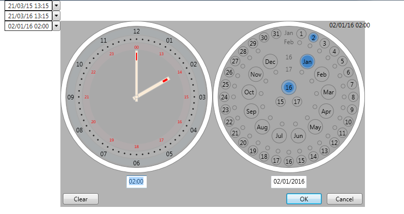

**Project Description**
Clock based Date Time Picker for WPF.

A WPF Date Time Picker supporting quick setting of date and time via keyboard or mouse.

The main features are:

* Simple clock based time selection via click and/or drag on a clock.
* Simple mouse based date selection.
* Text based date and time entry with auto completion suggestions.
* Extensible auto completion of dates and times (including absolute and relative time/date entry).

The code also includes other useful  primitive controls such as:

* Extensible Auto Completion Combo Box
* Simple Radial Panel

A screenshot from the demo application:

